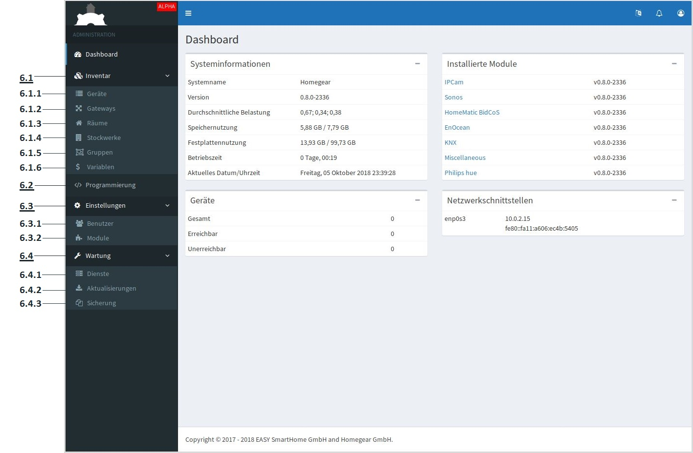

Admin-Oberfläche
################

Um auf die Admin Oberfläche zu gelangen, geben sie die Ip-Adresse ihrer Homegear-Box mit dem zusatz
":2001/admin/" in ihren Web-Browser ein. Beim erststart, erscheint ein Fenster, wo sie zunächst einen
Benutzername mit Kennwort hinterlegen müssen. Bei allen weiteren aufrufen müssen sie sich nurnoch damit Anmelden.

Nachdem sie sich erfolgreich eingeloggt haben, erscheint das Dashboard auf der Administrations Oberfläche.
Hier können sie Informationen zu System, Installierte Module, Geräte und Netzwerkschnittstellen entnehmen.

Inventar
========

Geräte
------

Gerät hinzufügen
^^^^^^^^^^^^^^^^

Gateways
--------

Gateway hinzufügen
^^^^^^^^^^^^^^^^^^

Räume
-----

Raum hinzufügen
^^^^^^^^^^^^^^^

Stockwerke
----------

Stockwerk hinzufügen
^^^^^^^^^^^^^^^^^^^^

Gruppen
-------

Gruppe hinzufügen
^^^^^^^^^^^^^^^^^

Variablen
---------

Variable hinzufügen
^^^^^^^^^^^^^^^^^^^

Programmierung
==============

