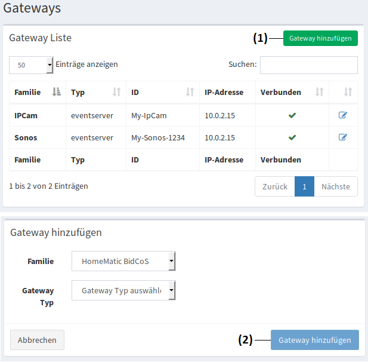

Admin-Oberfläche
################

Um auf die Admin Oberfläche zu gelangen, geben sie die Ip-Adresse ihrer Homegear-Box mit dem zusatz
"**:2001/admin/**" in ihren Web-Browser ein. Beim erststart, erscheint ein Fenster, wo sie zunächst einen
Benutzername mit Kennwort hinterlegen müssen. Bei allen weiteren aufrufen müssen sie sich nurnoch damit Anmelden.

Nachdem sie sich erfolgreich eingeloggt haben, erscheint das Dashboard auf der Administrations Oberfläche.
Hier können sie Informationen zu System, Installierte Module, Geräte und Netzwerkschnittstellen entnehmen.
In der rechten oberen ecke können sie unter:

- **(1)** die Sprache einstellen
- **(2)** System meldungen einsehen
- **(3)** Profileinstellungen ändern und sich ausloggen

.. image:: Admin-Oberfläche.png

Inventar
========
.. _L-Geräte

Geräte
------

In der Geräte Liste werden alle verbundene Geräte angezeigt. Hier können auch neue Geräte hinzugefügt werden. 
Geräte können beispielsweise Taster, Lampen, Regler, Lautsprecher... kurzum, sensoren und Aktoren sein.

Gerät hinzufügen
^^^^^^^^^^^^^^^^

.. note:: Bevor sie ein Gerät anlegen, sollten sie bereits :ref:`Gateways <L-Gateways>` angelegt haben.

Danach klicken sie auf **"Gerät hinzufügen"** **(1)**. Anschließen wählen sie noch die Familie, 
das Gateway und das Gerät, welches sie hinzufügen wollen aus. Anschließend bestätigen sie das mit 
dem Button **"Gerät hinzufügen"** **(2)**.

.. image:: Geräte-Final.png

.. _L-Gateways

Gateways
--------

Gateways vermitteln zwischen Systeme mit unterschiedlichen Protokollen. Sie fungieren als Bindeglieder, die die Kommunikation zwischen der Homegear-Box und den Gerätesysteme ermöglichen. Gateways sind zwingend notwendig, damit sie ihre Geräte mit der Homegear-Box benutzen können.

Gateway hinzufügen
^^^^^^^^^^^^^^^^^^
Um Gateways benutzen zu können, müssen diese zuerst hinzugefügt werden. Dazu klicken sie auf den Button **"Gateway hinzufügen"** **(1)**.
Anschließend wählen sie die Familie und den Gateway Typ aus und bestätigen das mit dem Button **"Gateway hinzufügen"** **(2)**.

.. _L-Räume

Räume
-----

Hier können sie Räume anlegen und ihnen angelegte Geräte zuweisen.

Raum hinzufügen
^^^^^^^^^^^^^^^

.. note:: Bevor sie einen Raum anlegen, sollten sie bereits :ref:`Geräte <L-Geräte>` angelegt haben.

Um einen Raum anzulegen, klicken sie auf **"Raum hinzufügen"** **(1)**. Anschließend müssen sie diesem einen Namen vergeben und Speichern.
Danach können sie unter **"Raum ändern"** **(2)** diesem Geräte hinzufügen **(3)**. Anschließend Speichern **(4)**.

.. _L-Stockwerke

Stockwerke
----------

Hier können sie Stockwerke anlegen, und ihnen angelegte Räume zuweisen.

Stockwerk hinzufügen
^^^^^^^^^^^^^^^^^^^^

Bevor sie ein Stockwerk anlegen, sollten sie bereits :ref:`Geräte <L-Geräte>` und :ref:`Räume <L-Räume>` angelegt haben.
Um ein Stockwerk anzulegen, klicken sie auf **"Stockwerk hinzufügen"** **(1)**. Anschließend müssen sie diesem einen Namen vergeben und Speichern.
Danach können sie unter **"Stockwerk bearbeiten"** **(2)** diesem Räume hinzufügen **(3)**. Anschließend Speichern **(4)**.

Gruppen
-------
Gruppen können angelegt werden um einzelne Geräte zu Gruppieren. So können Beispielsweise Raum übergreifend alle Beleuchtungen verwaltet und Gesteuert werden.

Gruppe hinzufügen
^^^^^^^^^^^^^^^^^

Bevor sie eine Gruppe anlegen, sollten sie bereits :ref:`Geräte <L-Geräte>` angelegt haben.
Um eine Gruppe anzulegen, klicken sie auf **"Gruppe hinzufügen"** **(1)**. Anschließend müssen sie dieser einen Namen vergeben und Speichern.
Danach können sie unter **"Gruppe bearbeiten"** **(2)** dieser Geräte hinzufügen **(3)**. Anschließend Speichern **(4)**.

Variablen
---------

Variable hinzufügen
^^^^^^^^^^^^^^^^^^^

Programmierung
==============

**Node-BLUE** ist unsere Programmier Oberfläche. Hier können sie Geräte miteinander verknüpfen und Abhängigkeiten erstellen, so wie Steuerungen für ihre Räume, Stockwerke oder Gruppen realisieren.

.. note:: Bevor sie mit der Programmierung anfangen können, müssen bereits Geräte so wie Räume, Stockwerke oder Gruppen angelegt sein

Die Programmier Oberfläche können sie auf der Adminoberfläche unter **"Programmierung"** **(5.2)**, oder über ihren Browser mit der IP-Adresse und dem 
zusatz "** :2001/node-blue/**" erreichen. Es erscheint zunächst ein Anmeldefenster, wo sie sich mit ihrem Benutzernamen und Kennwort anmelden müssen.

