.. _Link-auf-Node-BLUE-Bausteine:
Node-BLUE Bausteine
*******************

**input**
=========

mqtt
----
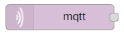

link
----
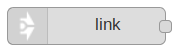

constant
--------
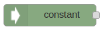

variable
--------
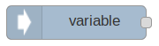

modbus
------
.. image:: modbus.png

gpio
----
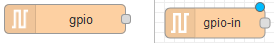

http
----
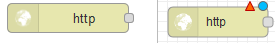

http request
------------
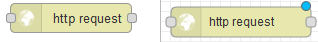

serial
------
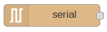

**output**
==========

light
-----
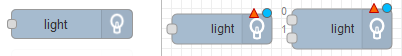

mqtt
----
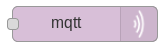

debug
-----

link
----
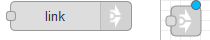

variable
--------
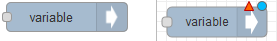

toggle
------
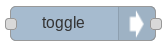

modbus
------
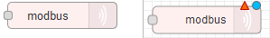

gpio
----
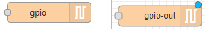

http response
-------------
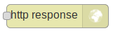

serial
------
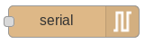

**function**
============

ping
----
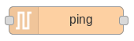

average
-------
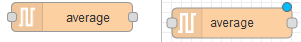

pulsecounter
------------
.. image:: pulsecounter.png

synchronous
-----------
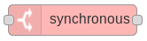

function
--------

press pattern
-------------
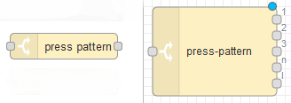

template
--------
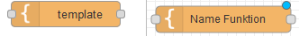

**storage**
===========

file
----
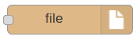

**time**
========

off delay
---------
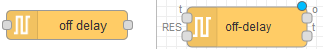

impulse
-------
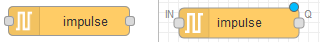

sun position
------------
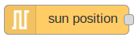

delay
-----
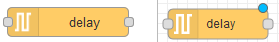

clock
-----
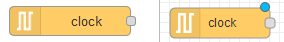

on delay
--------
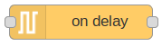

slow pwm
--------
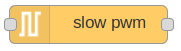

interval
--------
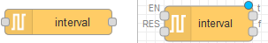

timer
-----
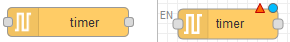

**parsers**
===========

xml
---
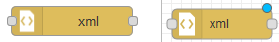

json
----
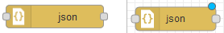

**logic**
=========

risingedge
----------

and
---
.. image:: and1.png

fallingedge
-----------

not
---
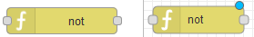

switch
------
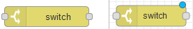

or
---

srflipflop
----------
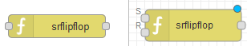

**general**
===========

comment
-------
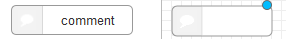

passthrough
-----------
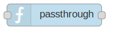

**heating**
===========

controller
----------
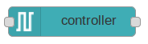

**database**
============

influxdb
--------
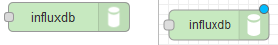

**notification**
================

xmpp
----
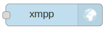

