.. _Link-auf-Node-BLUE-Bausteine:
Node-BLUE Bausteine
*******************

**input**
=========

mqtt
----
.. image:: mqtt.png

link
----
.. image:: link.png

constant
--------
.. image:: constant.png

variable
--------
.. image:: variable.png

modbus
------
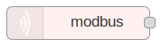

gpio
----
.. image:: gpio.png

http
----
.. image:: http.png

http request
------------
.. image:: httprequest.png

serial
------

**output**
==========

light
-----
.. image:: light.png

mqtt
----

debug
-----
.. image:: debug.png

link
----

variable
--------
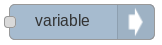

toggle
------
.. image:: toggle.png

modbus
------
.. image:: modbusoutput.png

gpio
----
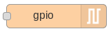

http response
-------------

serial
------
.. image:: serialoutput.png

**function**
============

ping
----

average
-------
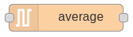

pulsecounter
------------
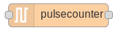

synchronous
-----------

function
--------
.. image:: function1.png

press pattern
-------------
.. image:: presspattern.png

template
--------
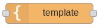

**storage**
===========

file
----
.. image:: file.png

**time**
========

off delay
---------
.. image:: offdelay.png

impulse
-------
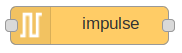

sun position
------------
.. image:: sunposition.png

delay
-----
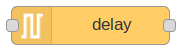

clock
-----
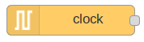

on delay
--------
.. image:: ondelay.png

slow pwm
--------

interval
--------
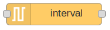

timer
-----
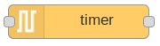

**parsers**
===========

xml
---
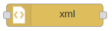

json
----

**logic**
=========

risingedge
----------
.. image:: risingedge.png

and
---
.. image:: and1.png

fallingedge
-----------

not
---
.. image:: not.png

switch
------
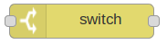

or
---

srflipflop
----------

**general**
===========

comment
-------
.. image:: comment.png

passthrough
-----------

**heating**
===========

controller
----------
.. image:: controller.png

**database**
============

influxdb
--------
.. image:: influxdb.png

**notification**
================

xmpp
----

