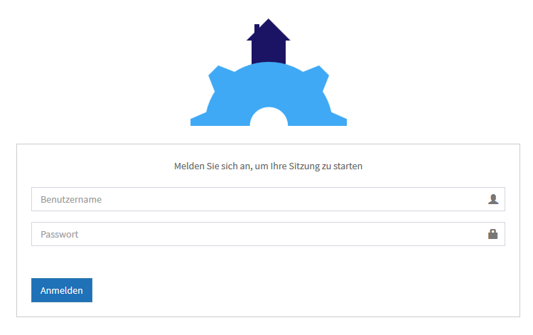
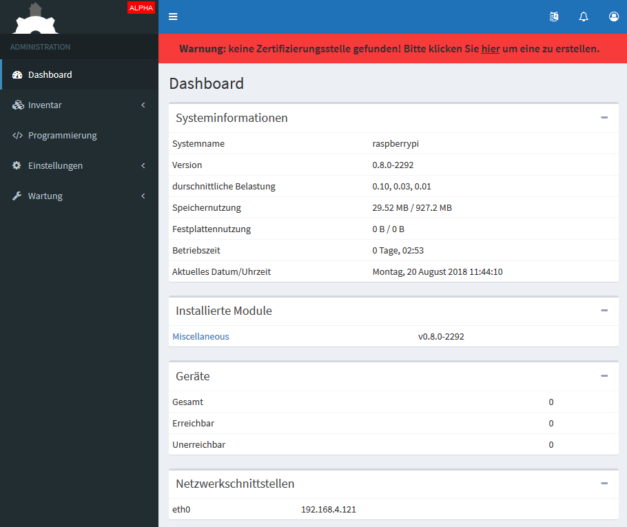
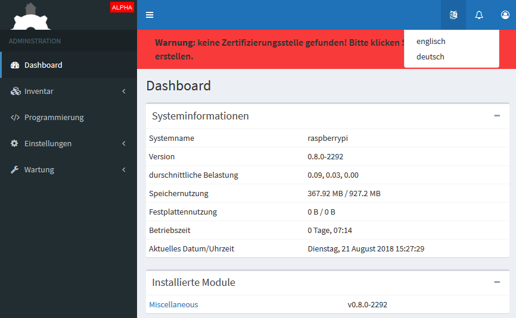
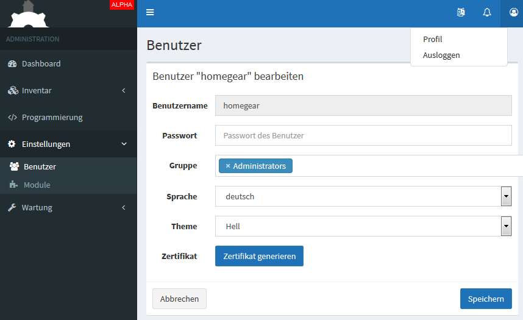
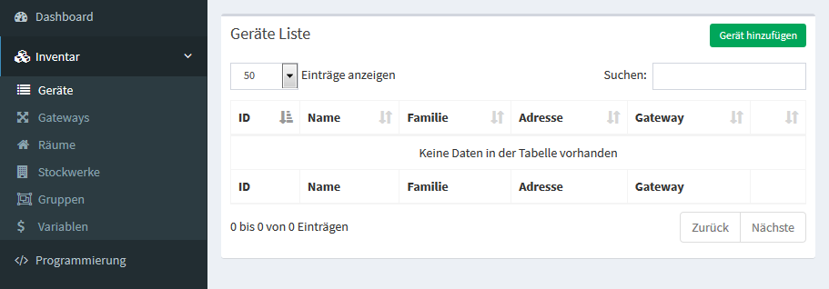
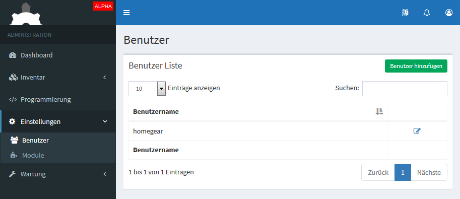
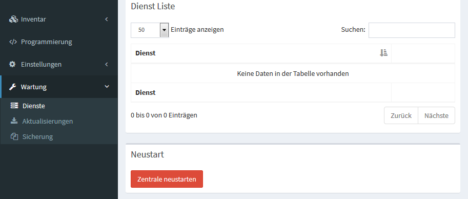

Installation
************

Inbetriebnahme
==============

Aufbau
------

.. tip:: ``Bevor sie starten, überprüfen sie bitte ob alle mitgelieferten Gegenstände in gutem Zustand sind.
 Diese sind unter dem Verzeichnis "Source/einleitung/Mitgeliefert" aufgelistet.
 Sollten sie nicht im Guten Zustand oder nicht vollständig sein Senden sie sie bitte an uns zurück.``

- Der erste Schritt ist die Homegear-Box mit dem mitgeliefertem Netzstromkabel zu verbinden, sowie den Netzstecker mit einer Steckdose in ihrem Haus.
  Nach dem das Netzkabel angeschlossen wurde leuchtet eine Rote Konroll-LED auf, die die Verbindung bestätigt.

.. caution:: Wenn Sie den Netzstecker ziehen, um die Homegear-Box ausschalten, warten sie mindestens 5 Sekunden bevor Sie diesen wieder einstecken.

- Als nächstes wird noch das begefügte LAN-Kabel benötigt, welches an die Homegear-Box und an die Netzwerksteckdose angeschlossen wird.
  Nach dem das Netzwerkkabel angeschlossen wurde leuchten zwei Kontroll-LEDs auf, grün(blinkend) und gelb(leuchtend). 

Wer die Pro Version verwendet oder die zweite Box montieren will muss nur die mitgelieferte Brücke in die dafür vorgesehenen Steckverbindungen beider Boxen einsetzen um eine Verbindung zwischen der Homegear-Box und dem Adapter herzustellen

Fertig, nun sendet und empfängt ihre Homegear-Box und ist bereit von innen programmiert zu werden

Software
--------

1. Voraussetztung ist ein Netzwerkfähiger PC, Labtop, Taplet oder Smartphone
2. Stellen sie sicher, dass sich ihre Homegear-Box im gleichen Heimnetz befindet wir ihr Coumputer
3. Starten sie wenn nicht schon geschehen ihren PC, Labtop oder Sonstiges und öffnen sie den Internetbrowser   

Um die Homegear-Box zu finden braucht man einen Internetprotokollscaner, den man unter diesem Link herrunterladen kann:
`Advanced IP Scanner <https://www.advanced-ip-scanner.com/de/>`

Sobald der Download fertig ist kann man das Programm aktivieren - bitte als Nächstes auf die Downloaddatei klicken, ausführen und 
anschliesend die gewünschte Sprache wählen und mit "Ok" bestätigen 

Wer die Datei installieren möchte kann auf "Weiter >" klicken, wer sie sich nicht installieren will wählt den Punkt neben Ausführen an und klickt "Weiter >"

Lesen sie bitte die Lizenzvereinbarung, klicken sie auf den Punkt neben "ich akzeptiere die Vereinbahrung" und bestätigen sie mit dem Button "Ausführen"

Das Fenster mit dem Namen "Advanced IP Scanner", dass sich nach der Bestätigung geöffnet hat enthält einen Button "Scannen", mit dem die Homegear-Box gesucht wird 

Das Programm wird die Geräte anzeigen, welche sich in der Nähe des Computers befinden bzw. im gleichen LANNetz verbunden sind

Nachdem das Programm fertig ist muss nach "Raspberry Pi Foundation" gesucht werden, um die IP-Adresse(Name) zu finden

.. caution:: In der Spalte wird jetzt der "Name" angezeigt, der aus einer **Reihe von Zahlen besteht**, diesen **Bitte in irgend einer Form speichern** 

Nun ist ihre Homegear-Box gefunden, um sich mit ihr zu verbinden muss "Name":2001/admin/ in den Internetbrowser eingegeben und mit der 
Entertaste bestätigt werden  

Wenn die Verbindung aufgebaut wurde ist dieser Startseiteninhalt zu sehen

.. note:: Hier dürfen Sie sich einen Anmeldenamen/Benutzernamen ausdenken und ein Passwort überlegen, welches Sie auch unbedingt in irgendeiner Form speichern sollten. Es spielt keine Rolle wie klein oder groß ihr Benutzername bzw. Passwort ist, dieser wird allein von Eingabespeicher begrenzt. Bitte geben sie dann anschliesend ihren Benutzernamen und ihr Passwort ein, bestätigen sie ihr Passwort und klicken sie auf "Anmelden".

Oben Rechts, wie im Bild gezeigt, wählt man zwischen den Sprachen Deutsch und Englisch aus, da die Voreinstellung Englisch ist, wird empfohlen aufgrund der Anleitung auf Deutsch umzuschalten

Neben dem gerade benutztem Symbol der Sprachauswähl ist eine Klingel zusehen, welche Fehlermeldungen entgegennimmt und anzeigt  

Ihr Profil können sie über der rechten Oberen Button anwählen und änderen, 
Auserdem können sie die Gruppe ändern auf die der Benutzer zugriff haben soll.  

Wie zu sehen ist zeigt das Dashboard die Systeminformationen, installierte Module, Geräte und die Netzwerkschnittstellen auf.
Es enthält die wichtigsten Technischen Daten, die sehr überschaubar einlesen kann.
Wenn sie fertig sind klicken sie auf "Speichern".

Inventar
^^^^^^^^

Öffnet man das Inventar werden folgende Unterpunkt ausgefahren

Geräte
""""""

Hier kann die (Dateiformat)Familie ausgewählt werden mit der das anzuschliesende Gerät arbeitet.
nächster Punkt ist das Gerät selbst und der Type des Gateways 

.. note :: ein Gateway ist sowas wie ein Übersetzter, es übersetzt die Sprache eines Gerätes in die, mit der die Homegear-Box kommuniziert, wenn alle benötigten Gateways vorhanden sind können sich alle Geräte mitteinander verbinden (kommunizieren)

Gateways
""""""""

Hier kann die (Dateiformat)Familie und anschliesend auch der Type des Gateways ausgewählt werden

Räume
"""""

		Der Raumname ist beim anklicken des Bottens "Raum hinzufügen" zu erstellen bzw. zu ändern.
		Wenn das Abschalten eines Raumes erwünscht wird kann dies so in z.B. Node Blude einfach eingestellt werden 
		mehr dazu unter :ref:`Konfiguration <Link auf Konfiguration>`   

Stockwerke
""""""""""

		Es hat die Gleiche Funktion wie Räume, nur dass die Funktion Stockwerke alle Räume in diesem Stockwerk einbinden soll,
		um ein ganze Wohnung oder Ebene im Haus auf einen Befehl hin ansteuern zu können 

Gruppen
"""""""

		Mit Gruppen sind Geräteverknüpfungen gemeint, die man gerne verbunden hätte und sich mit einem Befehl steuern lassen 
		Somit lassen sich alle Lichter oder nur gewünschte LichterGruppen kontrollieren, was sehr komfortabel ist   

Variablen
"""""""""

		Hier kann der Variablenname für die Geräte vergeben und auch der Type definiert werden
		Auserdem ist sie "Global" und kann auch in anderen Programmierplattformen unter dem gleichen Namen verwendet werden 

.. tip:: Es ist wichtig sich Räume Stockwerke oder Gruppen anzulegen um einen Überblick für alle angeschlossenen Systeme zu haben 

.. note:: Die (Dateiformat)Familie oder Protokollfamilie ist auf jedem Gerät vermerkt

Programmierung
^^^^^^^^^^^^^^

Node-BLUE ist unsere Prgrammierplattform für die Verknüpfung der Geräte im Haus

Hier werden die Verknüpfungen der Geräte bearbeitet, mehr dazu unter dem Punkt :ref:`Programmierung <Link auf Konfiguration>`

Einstellungen
^^^^^^^^^^^^^

Hier befinden sich die Benutzter und Module welche wie gelistet werden wie im Inventar

Benutzter
"""""""""

Hier kann der Benutzername, die Sicherung über ein Passwort und Zuweisung in eine Gruppe eingestellt werden

Module
""""""

Hier werden die vorhandenen Module gelistet die geladen sind, es besteht die Möglichkeit diese hier zu deaktivieren oder neu zu laden

Wartung
^^^^^^^

Dienste, Aktualisierungen und Sicherungen können hier überprüfen und eingesehen werden 

Dienst
""""""

Wenn man die Zentrale neu startet wird Ihre "Homegear-Box" neu gestartet 

Aktualisierungen
""""""""""""""""

Wenn eine neue Aktualisierung vorliegt bitte auf den Button "Aktualisierungen installieren" klicken

Sicherung
"""""""""

Hier kann eine Sicherung erstellt oder bei Bedarf wiederhergestellt werden

