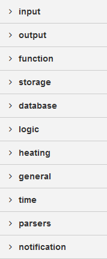

.. _Link-auf-Konfiguration:

Konfiguration
*************

Node-BLUE
=========

Öffnen von Node-BLUE
--------------------

`Node-BLUE <http://homegear-ip:2001/node-blue/>` ist die Programmierplattform mit der die Verknüpfung aller Geräte im Haus hergestellt wird

.. image:: Node-BLUE.png

In der linken Spalte befinden sich die Bausteine, die für die Programmierung benötigt werden

Wird beispielsweise auf "input" geklickt, öffnet sich darunter ein Abschnitt mit neun verschiedenen Punkten 

Angenommen es soll ein Schalter mit einer Lampe verknüpft werden, sodass die Lampe mit einem Tastendruck auf den Schalter aufleuchtet 

So muss mit der Maus, auf den Baustein "Variable" aus der linken Spalte, gekickt und gehalten werden, um diesen in das Feld "Flow 1" bewegen zu können

Die Grauen Punkte an den Bausteinboxen können mit der gleichen Vorgehensweise miteinander verbunden werden, Schwarze geschwungene Linien signalisieren die Verbindung

Alle Bausteine lassen sich so verschieben und verbinden 

Wenn eine Verbindung zwischen zwei Geräten hergestellt ist muss nur noch auf den Button "Deploy" in der Oberen Rechten Ecke gekickt werden und die Verbindung kann sofort getestet und gegebenenfalls angepasst werden

Bausteine Kategorien von Note-BLUE
----------------------------------

Hier ist die Linke Spalte von Node-BLUE mit den 11 Bausteinkategorien dargestellt, auf die in den folgenden Punkten Stück für Stück näher eingegangen wird
In den Bausteinkategorien gibt es verschiedene Bausteine die mit eigenen Namen versehen werden können
Sie funktionieren nach einem Baukastenprinzip, mit welchem sich teortisch nach Fantasie seine ganz eigene Kombination zurechtgelegt und verbunden werden kann. 
Warum nicht jede Kombination Sinn macht bzw. nicht funktionieren kann wird für die Grundlegenden Kombinationen einmal aufgezeigt

Zu Beginn ist zu Wissen, dass die gewünschten :ref:`Variablen <Link-auf-Variablen>`, :ref:`Familien <Link-auf-Familien>`, :ref:`Gruppen <Link-auf-Gruppen>` und :ref:`Module <Link-auf-Module>` auf der `Homegear-Box Webside <homegear-Ip:2001/admin/>` einzustellen sind

Anlernen von Geräten
--------------------

Um mit den verschiedenen Geräten arbeiten zu können, müssen sie die dafür vorgesehene Familie, sowie auch das benötigte Gateway installieren 

.. Hier fehlt noch etwas

Anlegen der :ref:`Räume <Link-auf-Räume>`, :ref:`Stockwerke <Link-auf-Stockwerke>`, :ref:`Gruppen <Link-auf-Gruppen>` und :ref:`Variablen <Link-auf-Variablen>`
---------------------------------------------------------------------------------------------------------------------------------------------------------------

Die Zusammensetzung und die Auswahl der Namen ist ganz Ihnen überlassen, allerdings ist ein sinnvoller Name zu empfehlen, da es Ihnen einen Überblick bietet und Sie es einfacher haben, wenn sie zu einem späteren Zeitpunkt etwas ändern möchten.
Auserdem kann eine klare Namensgebung für eine einfachere Bedienung Dritter sorgen, wie zum Beispiel um Kindern die Steuerung der Geräte im Kinderzimmer zu ermöglichen die Sie davor ausgewählt und beschriftet haben.

Kombination der Bausteine
-------------------------

So sie die Bausteine angeordnet und verbunden werden, funktionieren dann auch die Geräte miteinander.
Wie die Bausteine angeordnet werden müssen, um das zu bauen was man gerne hätte, wird hier erläutert

