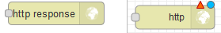
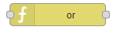

.. _Link-auf-Node-BLUE-Bausteine:
Node-BLUE Bausteine
*******************

> input
=======

In der Katekorie input werden ausgehende Informationsgeber geführt, welche die Steuereinheit bilden, mit der Ihr Smart Home bedient wird 

serial
------
.. image:: serial.png

gpio
----
.. image:: gpio.png

mqtt
----
.. image:: mqtt.png

http
----
.. image:: http.png

http request
------------
.. image:: httprequest.png

modbus
------
.. image:: modbus.png

variable
--------
.. image:: variable.png

constant
--------
.. image:: constant.png

Hiermit sind Taster gemeint denen Namen gegeben werden kann, wie "Lichtschalter-Küche-Nord", doch eine weitere Einstellung macht es möglich
im ein Speichertype zu geben 

link
----
.. image:: link.png

> output
========

Die Kategorie Output ist der durch die Steuerung entstehende reale Effekt, im Grunde das was im Haus an der gewünschten Stelle elektronisch angesteuert werden soll - z. B. Licht, Thermostat, Feuchtigkeitsüberwachung etc.  

serial
------
.. image:: serialoutput.png

gpio
----
.. image:: gpiooutput.png

mqtt
----
.. image:: mqttoutput.png

http responce
-------------

light
-----
.. image:: light.png

modbus
------
.. image:: modbuoutput.png

variable
--------
.. image:: variableoutput.png

toggle
------
.. image:: toggle.png

link
----
.. image:: linkoutput.png

debug
-----
.. image:: debug.png

> function
==========

press pattern
-------------
.. image:: presspattern.png

average
-------
.. image:: average.png

ping
----
.. image:: ping.png

template
--------
.. image:: template.png

pulsecounter
------------
.. image:: pulsecounter.png

synchronous
-----------
.. image:: synchronous1.png

function
--------
.. image:: function1.png

> storage
=========

file
----
.. image:: file.png

> database
==========

influxdb
--------
.. image:: influxdb.png

> logic
=======

or
---

srflipflop
----------
.. image:: srflipflop.png

risingedge
----------
.. image:: risingedge.png

not
---
.. image:: not.png

fallingedge
-----------
.. image:: fallingedge.png

switch
------
.. image:: swtich.png

and
---
.. image:: and1.png

> heating
=========

controller
----------
.. image:: controller.png

> general
=========

passthrough
-----------
.. image:: passthrough.png

comment
-------
.. image:: comment.png

> time
======

on delay
--------
.. image:: ondelay.png

timer
-----
.. image:: timer.png

off delay
---------
.. image:: offdelay.png

sun position
------------
.. image:: sunposition.png

interval
--------
.. image:: interval.png

delay
-----
.. image:: delay.png

clock
-----
.. image:: clock.png

slow pwm
--------
.. image:: solwpwm.png

impulse
-------
.. image:: impulse.png

> parsers
=========

xml
---
.. image:: xml.png

json
----
.. image:: json.png

> notification
==============

xmpp
----
.. image:: xmpp.png

Das Rote kleine Dreieck soll anzeigen, dass der Baustein noch nicht deploy-fähig mit einem Doppelklick kann das Einstellungsfeld geöffnet werden und die Einstellungen verändert werden